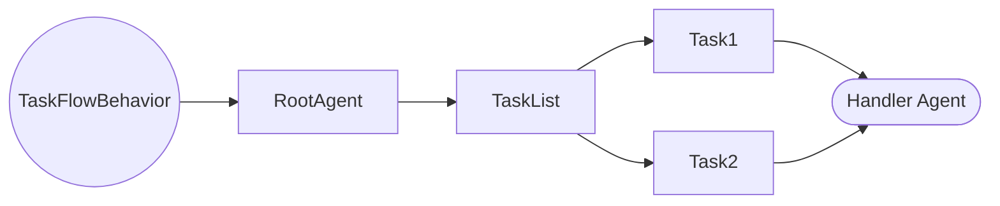

# Behavior

PTT provides the ability to create [Agents](agents.md) that are responsible for various tasks. **Behavior** is the 
parent object that defines *how* they accomplish those tasks.

You can think of the **Behavior** object like a Project Manager. They set the plan for how to resolve a task, and direct
both the requests and responses to the right agents. 

From a code perspective, the Behavior object is also the interface for the user to actually define the agentic behavior
(hence the name).

**Behaivor** objects are responsible for managing the [Context](context.md) as agents generate responses or 
execute functions.

## Creating a Behavior
Each type of Behavior will have its own implementation details. The most basic type of Behavior is the 
"TaskFlowBehavior" type.

### TaskFlowBehavior

In `TaskFlowBehavior`, the 'root' agent first breaks the initial query into a series of tasks. It then distributes 
each task to the handler agent. The handler agent can have any number of other agents attached to it, allowing for 
complex, recursive behavior - or it can handle the entire thing itself! It's up to you.

::: python_to_tools.ptt.TaskFlowBehavior.__init__
    options:
        toc_label: "Task Flow Behavior"
        show_root_toc_entry: false